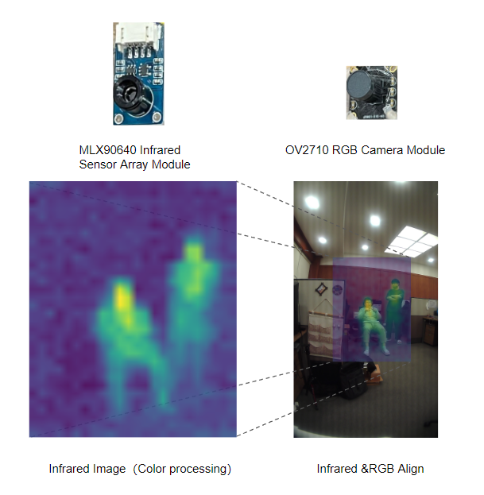
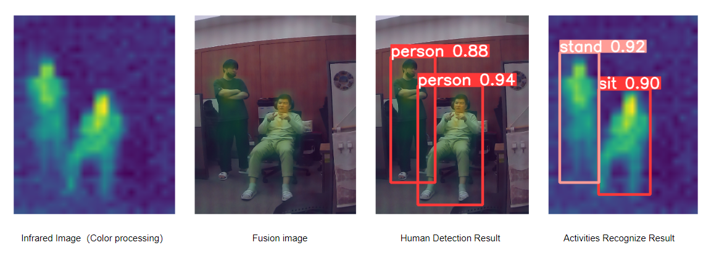

# Real-time human detection and behavior recognition using low-cost hardware
# Thermal Image Dataset

This dataset was collected by us using the low-resolution infrared imaging module MLX90640. The IR raw sensor resolution in this dataset is 32x24.




Check out the codes in another repo [here](https://github.com/InfoLab-SKKU/Thermal-Human-Detection)
## Citation
We would appreciate it if you would consider citing our work when using our code.

```bibtex
@inproceedings{wang2023real,
  title={Real-time human detection and behavior recognition using low-cost hardware},
  author={Wang, Bojun and Ali, Sajid and Fan, Xinyi and Abuhmed, Tamer},
  booktitle={2023 17th International Conference on Ubiquitous Information Management and Communication (IMCOM)},
  pages={1--8},
  year={2023},
  organization={IEEE}
}
```
